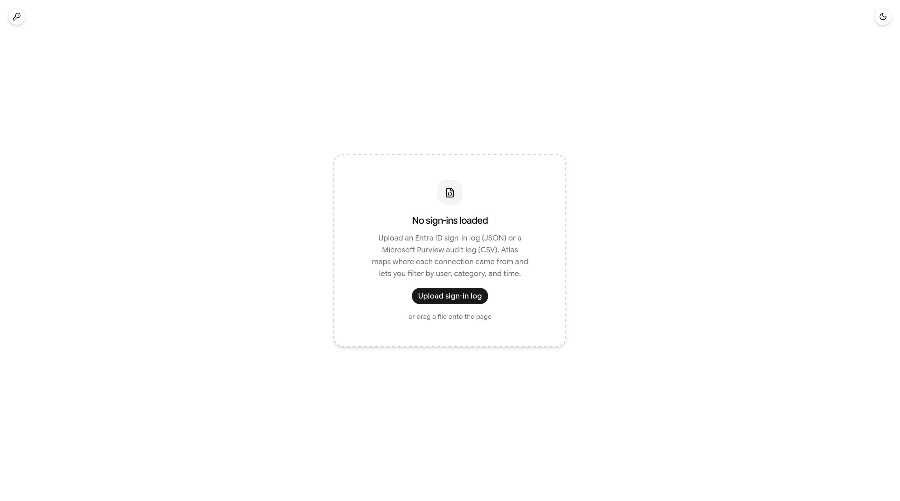
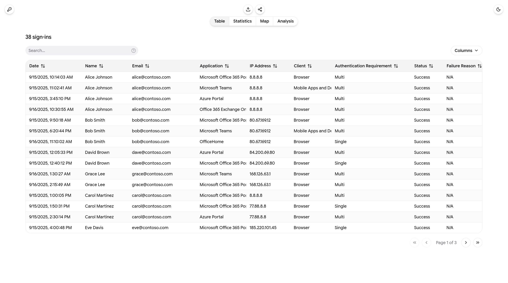
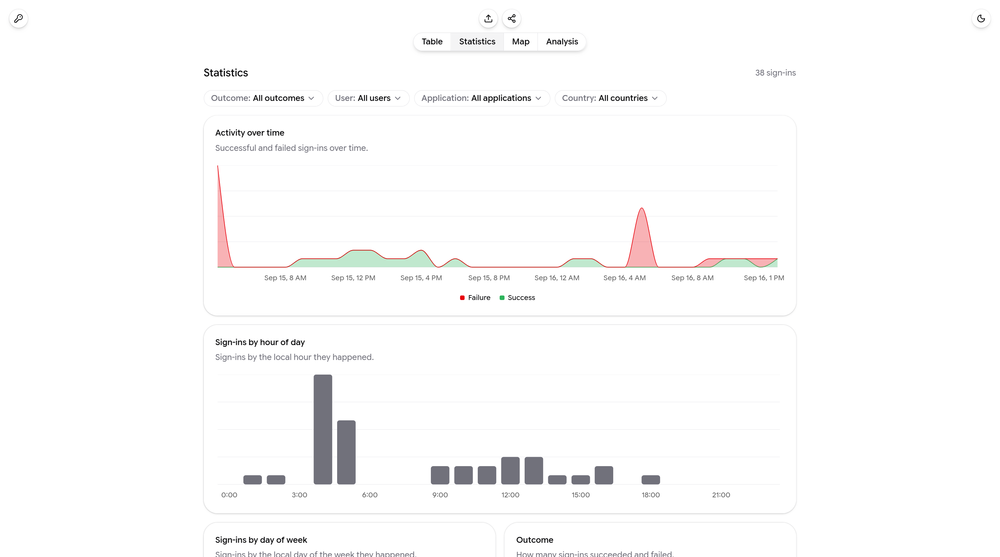
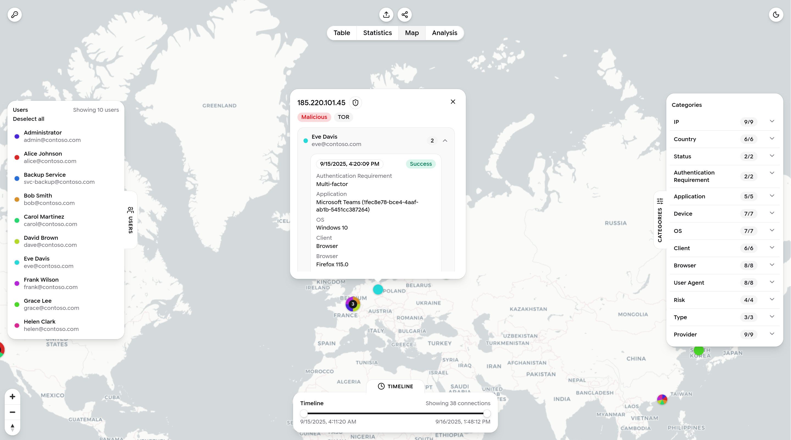
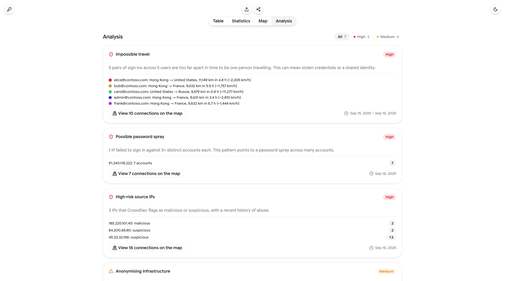

# Atlas

<div align="center">

[](https://github.com/Eudaeon/atlas/stargazers)
[](https://github.com/Eudaeon/atlas/network)
[](https://github.com/Eudaeon/atlas/issues)
[](LICENSE)

**A browser tool to map and triage Microsoft sign-in logs by location, network, and risk.**

</div>

## Overview

Atlas reads a Microsoft sign-in export and shows who connected, from where, and whether the activity looks suspicious. Upload an Entra ID sign-in log (JSON) or a Microsoft Purview unified audit log (CSV); the app enriches every source IP and presents it across a table, charts, a map, and a ranked list of security findings.

Everything runs in the browser. The logs are never sent anywhere except for the IP lookups and the optional share feature.

<div align="center">



</div>

**How it works:**

- **Parsing**: the Entra JSON and Purview CSV exports are converted into one sign-in shape, so every view works the same regardless of source. Malformed and redacted rows are dropped on input.
- **Enrichment**: source IPs are looked up through [ProxyCheck.io](https://proxycheck.io/) for geolocation and network type, and through [CrowdSec](https://www.crowdsec.net/) CTI for risk: a reputation verdict plus the attack behaviours, CVEs, MITRE techniques, and blocklists tied to each address. Lookups are batched, rate-limit aware, and cached for the session.
- **Analysis**: heuristics flag anonymising infrastructure, impossible travel, password-spray patterns, and MFA gaps. Each finding is ranked by severity and linked to the connections it covers on the map.
- **Sharing**: a dataset can be compressed and uploaded behind a short link, so a recipient opens the same view without re-running the lookups.

## Setup

Node.js is required.

```bash
git clone https://github.com/Eudaeon/atlas.git
cd atlas
npm install
```

### Running locally

The dev server runs the interface together with the enrichment proxies and share backend, which live as Cloudflare Pages Functions (`functions/`):

```bash
npm run dev
```

### Desktop app

Atlas also runs as an Electron desktop app, wrapping the same UI without a browser or a Cloudflare deployment. The enrichment proxies (which exist only to work around browser CORS) run in the Electron main process (`electron/`), so lookups behave identically.

```bash
npm run electron:dev      # develop; reload the window to pick up changes
npm run electron:build    # build installers into release/
```

Both commands prompt for the **share URL**: the hosted Atlas that desktop share links point at and upload to, since sharing needs a real deployment. Enter your deployment's URL, or `none` to run without the share feature.

### Sharing backend

Sharing stores payloads in a Cloudflare KV namespace bound as `SHARE_KV`. For local development the namespace is simulated from `wrangler.toml`, so nothing needs setting up. To deploy, create the namespace once and paste its ID into `wrangler.toml`:

```bash
npx wrangler kv namespace create SHARE_KV
```

## Exporting the logs

Atlas reads two Microsoft sign-in sources. They overlap, but each has its own format, retention window, and limits.

### Microsoft Entra ID

The native sign-in logs, exported as JSON. In the [Microsoft Entra admin center](https://entra.microsoft.com), go to **Users**, set a date range, then **Download → JSON**. Two log types are worth exporting:

- **Interactive sign-ins**: user-initiated sign-ins where someone actively provided a credential or second factor. The human-facing activity.
- **Non-interactive sign-ins**: sign-ins a client performs on the user's behalf, such as token refreshes and background authentication. Higher in volume, and useful for spotting automated or token-replay activity.

> [!IMPORTANT]
> Entra retention is short: 7 days by default, 30 days with an Entra ID P1 or P2 license. Export before the window closes, or stream the logs to Log Analytics for longer retention.

### Microsoft Purview

The unified audit log, exported as CSV. In the [Microsoft Purview portal](https://purview.microsoft.com), go to **Audit**, search your date range, and **Export**. Under **Activities – operation names**, select the sign-in operations:

```text
UserLoggedIn,UserLoginFailed
```

Each row carries the sign-in detail as JSON in its `AuditData` column. Purview records less per sign-in than Entra: it omits the client app category, browser, device details, and conditional-access state, so the app infers what it can (the client and browser from the user agent) and leaves the rest blank. Expect a sparser table and fewer findings.

> [!TIP]
> The trade-off is reach. Purview is retained far longer: 180 days with Audit (Standard), up to a year with Audit (Premium). Use Entra for the fullest detail within its short window, and Purview for activity older than that.

## Usage

Press **Upload** (or `U`) and pick the JSON or CSV file you exported. The app converts both into the same shape, so every view works the same regardless of source. Enrichment runs automatically once the data loads; then switch between the four views.

> [!TIP]
> Just looking around? Load the included [`sample-signins.json`](sample-signins.json), a small synthetic Entra export that populates every view and trips most of the findings: impossible travel, password spray, anonymising infrastructure, repeated failures, MFA gaps, and legacy auth.

### Table

Every sign-in, searchable and sortable, with enrichment merged into each row.

<div align="center">



</div>

### Statistics

Activity over time plus categorical breakdowns (outcome, authentication, client, country, connection type, risk).

<div align="center">



</div>

### Map

Connections clustered by location, filterable by user, category, and a draggable time range.

<div align="center">



</div>

### Analysis

Security findings ranked by priority, each with the users and IPs involved and a jump to view those connections on the map.

<div align="center">



</div>

Use **Share** (or `S`) to copy a short link to the full dataset.

### Keyboard shortcuts

<div align="center">

| Key |               Action              |
|:---:|:---------------------------------:|
| `U` |        Upload a sign-in log       |
| `V` |        Cycle through views        |
| `S` |         Copy a share link         |
| `T` |      Toggle light/dark theme      |
| `1` |    Toggle the Users panel (map)   |
| `2` | Toggle the Categories panel (map) |
| `3` |  Toggle the Timeline panel (map)  |

</div>

## Configuration

### API keys

Click the key icon (top-left) to set the enrichment keys, stored only in the browser's local storage. Both sources are optional. Without them, the table and map still work on whatever data is present. Each source accepts any number of keys: lookups are split into batches and spread across the keys at once, so more keys means more throughput. If a key is rejected or hits its rate limit mid-run, it drops out of the pool and its remaining batches are picked up by the others.

- **ProxyCheck.io**: geolocation and network type. Add a [ProxyCheck.io](https://proxycheck.io/) key to locate each source IP and flag proxy, VPN, hosting, and Tor addresses.
- **CrowdSec CTI**: risk and threat intelligence. Add a [CrowdSec](https://www.crowdsec.net/) CTI key for the reputation verdict, scores, behaviours, CVEs, MITRE techniques, and blocklists tied to each address.

On the map, IPs that CrowdSec has data for show a shield button in their details popover; click it to open the full threat-intelligence dialog for that address.

### Scripts

<div align="center">

|       Command       |              Description             |
|:-------------------:|:------------------------------------:|
|    `npm run dev`    |    Start the dev server (UI and API) |
|   `npm run build`   |  Type-check and build for production |
| `npm run typecheck` |          Type-check the app          |
|    `npm run lint`   |              Run ESLint              |
|   `npm run deploy`  | Build and deploy to Cloudflare Pages |

</div>

## Deployment

Atlas deploys to [Cloudflare Pages](https://pages.cloudflare.com/): the SPA is served as static assets and the API runs as Pages Functions from `functions/`. There are two ways to ship it.

### Git integration (recommended)

With a Pages project connected to Git, Cloudflare rebuilds and redeploys on every push, with no deploy command or API token to manage. In the [Cloudflare dashboard](https://dash.cloudflare.com/), go to **Compute → Workers & Pages → Create application → Pages → Import an existing Git repository**, select this repo, and set:

|         Setting        |      Value      |
|:----------------------:|:---------------:|
|    Framework preset    |      `None`     |
|      Build command     | `npm run build` |
| Build output directory |      `dist`     |

The `SHARE_KV` binding comes from `wrangler.toml` (see [Sharing backend](#sharing-backend)), so there is nothing to configure in the dashboard.

### Manual deploy

To deploy from your machine, first authenticate Wrangler, then run the deploy script:

```bash
npx wrangler login
npm run deploy
```

This builds the app and uploads the build output and Functions to Cloudflare Pages in one step.
