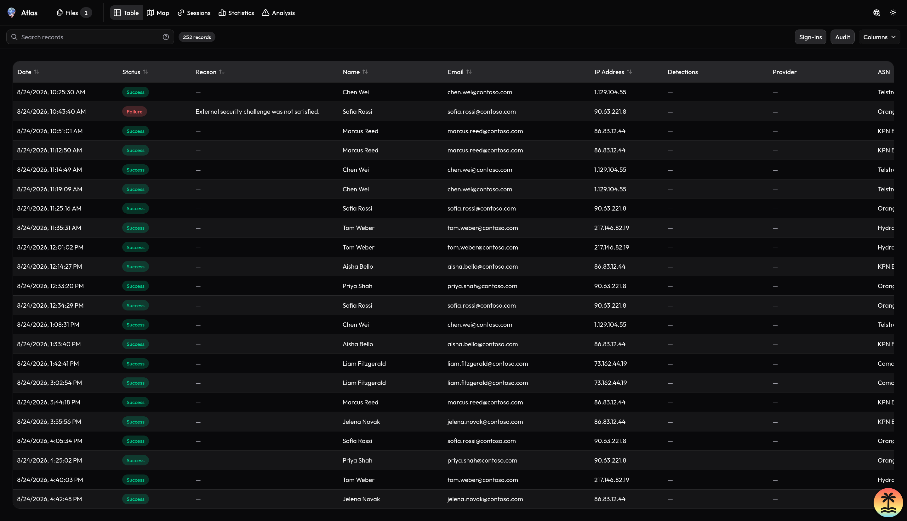
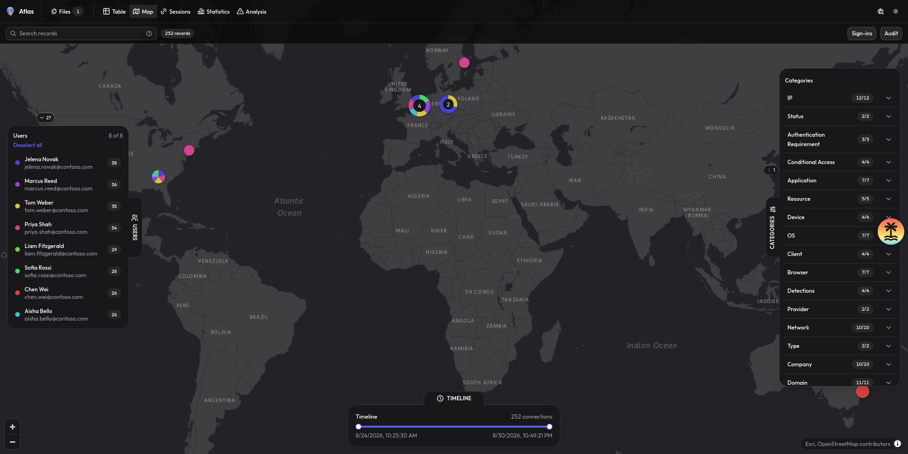
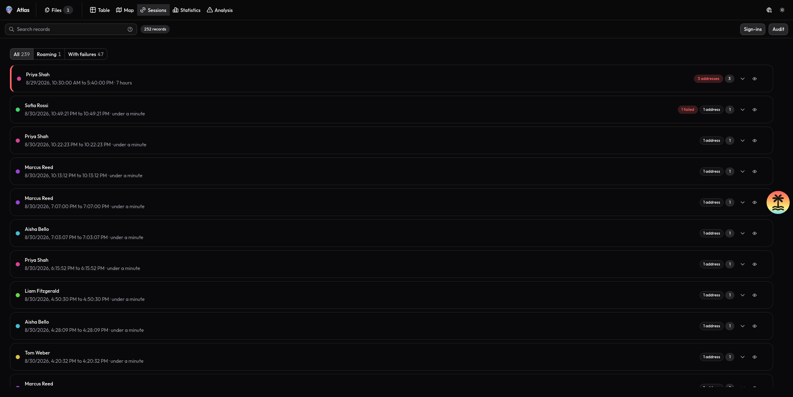
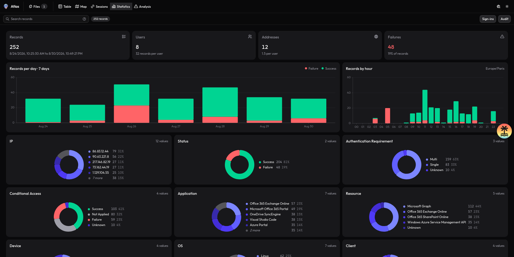
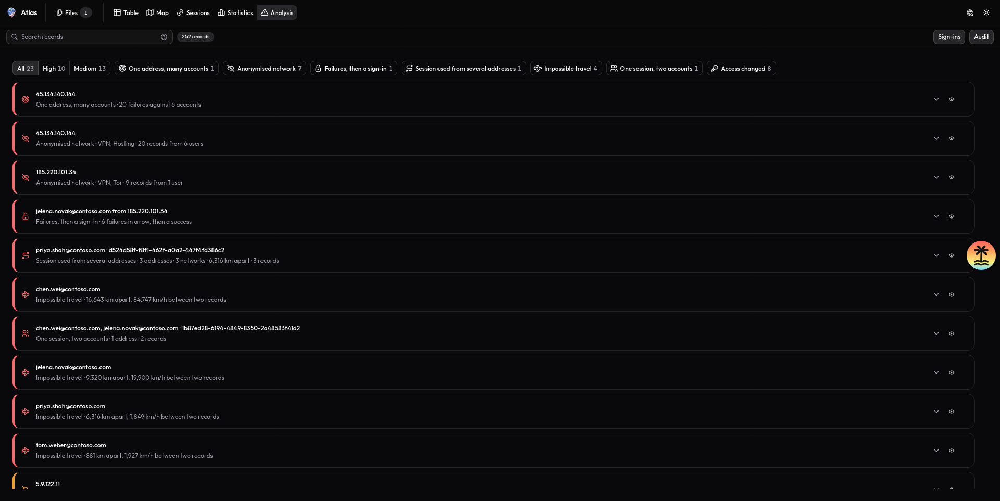

<div align="center">


# Atlas

_An application that reads Microsoft Entra sign-in and audit log exports and
puts them on a map_

</div>

Drop an export on the window: Graph JSON (either a bare array or
`{ "value": [...] }`), or the CSV a Purview audit search downloads. Sign-in,
audit and Purview records can be open at once. Atlas looks up every IP address,
draws the connections, and flags what looks like a compromised account.

<!-- prettier-ignore -->
> [!TIP]
> [`example/entra-sample.json`](example/entra-sample.json) is an invented export
> to try it on: 242 sign-ins and 10 audit records, from eight accounts and
> thirteen addresses.

## Install

```bash
npm install
npm run dev
```

Atlas runs at `http://localhost:3000`. `npm run deploy` builds and deploys to
Cloudflare Workers.

## Purview exports

Paste this into the activities box of the audit search:

```
UserLoggedIn,UserLoginFailed,MailItemsAccessed,MailboxLogin,Send,SendAs,SendOnBehalf,New-InboxRule,Set-InboxRule,UpdateInboxRules
```

Atlas drops every other row on load, so a wider search only makes the download
bigger.

## IP enrichment

The lookups need a [ProxyCheck.io](https://proxycheck.io) key. Atlas asks for
one and holds the queue until it has it. A free key covers a thousand addresses
a day. Each lookup returns coordinates, proxy and VPN detections, and the
operator behind the address. Without them the map has nothing to place and the
analysis has no networks to flag.

Paste in more than one key, one per line, and they work as a pool: a refused key
drops out of the run and hands its batch to the next.

Exporting writes the rows back out with the results beside them, so opening that
file again skips the lookup.

<!-- prettier-ignore -->
> [!WARNING]
> The keys and the last eight searches sit in localStorage in cleartext.
> Anything running in that window can read them.

## Views

`Alt` and a number switches view. All five show only the records that match the
search.



**Table.** One column per field Atlas reads, virtualized both ways. Policies and
authentication steps expand in place. Purview records name an application only
by id, so Atlas looks them up in a bundled copy of
[merill/microsoft-info](https://github.com/merill/microsoft-info).



**Map.** One marker per address, split by user. Clusters are donuts with the
number of places in the hole.



**Sessions.** Sign-ins grouped by session id. Sessions used from several
addresses come first.



**Statistics.** Counts by day and by hour, and the busiest values in every
category.



**Analysis.** Anonymised networks, impossible travel, one address against many
accounts, failures ending in a success, sessions shared between accounts,
sessions used from several addresses, and audit records that grant access. Each
finding comes with the search that shows the records behind it.

## Search

Lucene syntax, applied to every view. A term matches part of a value and ignores
case.

| Query                             | What it does              |
| --------------------------------- | ------------------------- |
| `jelena`                          | matches any column        |
| `os:windows`                      | matches one column        |
| `resource:"Graph API"`            | exact phrase              |
| `browser:Chrome*`                 | `*` and `?` are wildcards |
| `status:/Succ.../`                | regular expression        |
| `date:[2026-08-01 TO 2026-09-01]` | range, `*` for open-ended |
| `windows failure`                 | two terms mean AND        |
| `os:Windows OR os:Linux`          | AND, OR, NOT              |
| `-status:Success`                 | `-` or `NOT` excludes     |
| `status:(Success OR Failure)`     | group terms in one column |

A field name is its column heading in camelCase, so `Record ID` is `recordId`
and `OS` is `os`. The help button in the search box lists every one.

## Keys

| Key                   | What it does                                    |
| --------------------- | ----------------------------------------------- |
| `/`                   | the search box                                  |
| `Ctrl` `K`            | the search box, from inside another field       |
| `Esc`                 | clear the search, from inside the box           |
| `Alt` `1` … `Alt` `5` | table, map, sessions, statistics, analysis      |
| `1` `2` `3`           | the map's users, categories and timeline panels |

Every key except Ctrl-K and Esc is ignored while you are typing into a field.

---

<a href="https://www.flaticon.com/free-icons/atlas" title="atlas icons">Atlas
icons created by max.icons - Flaticon</a>
